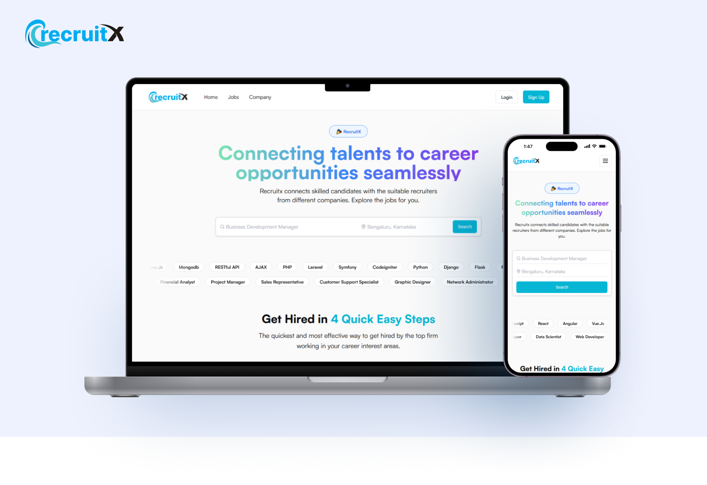
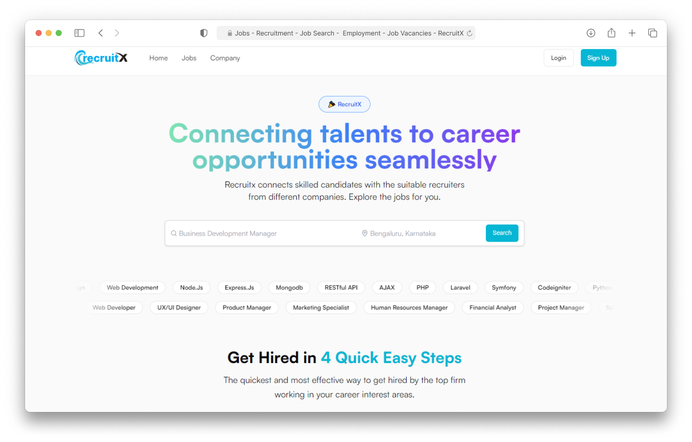
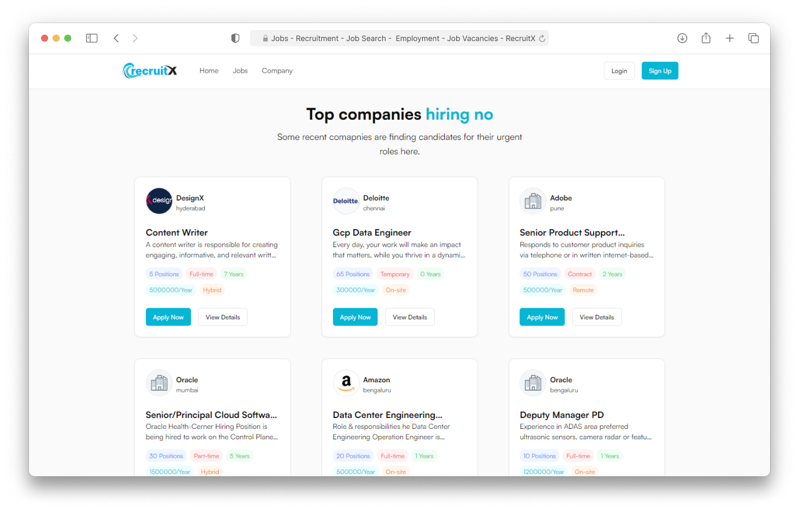
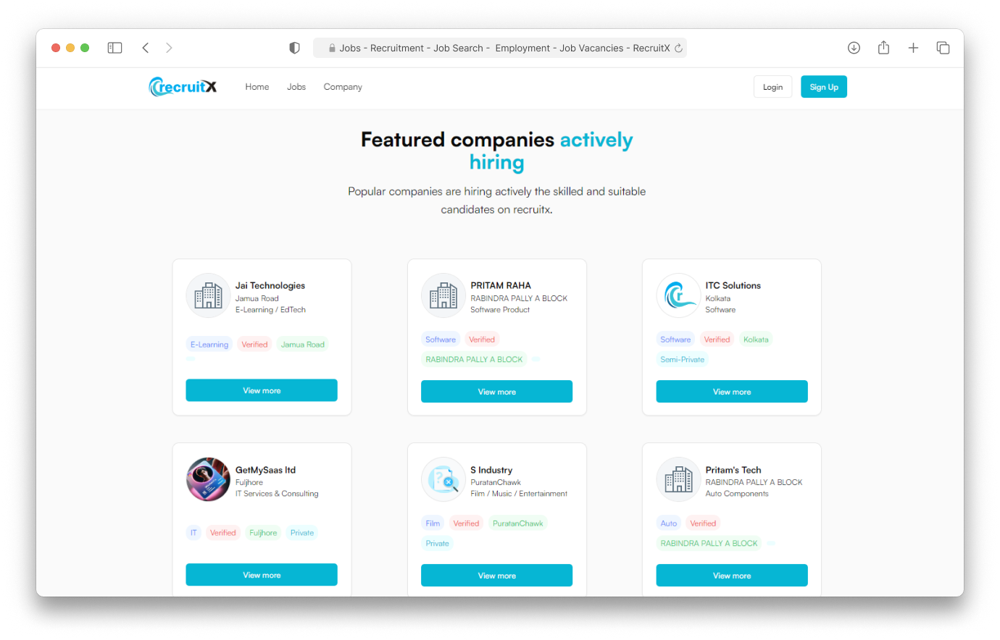
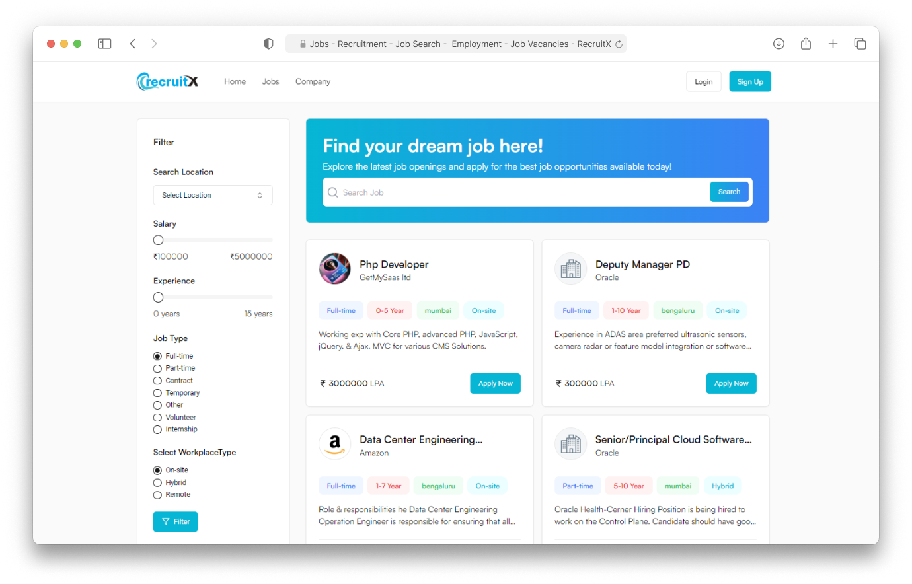
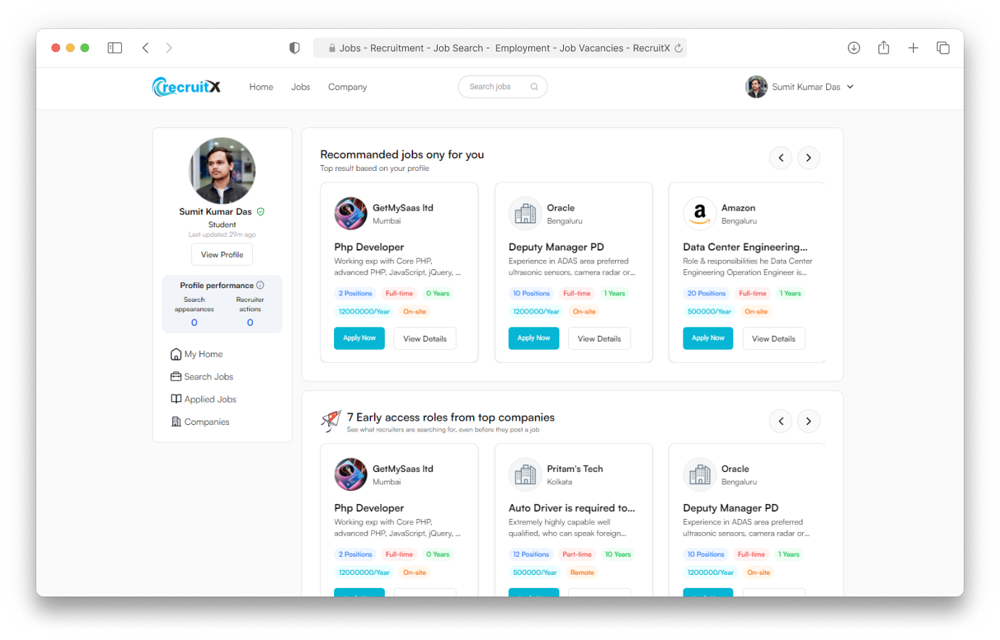
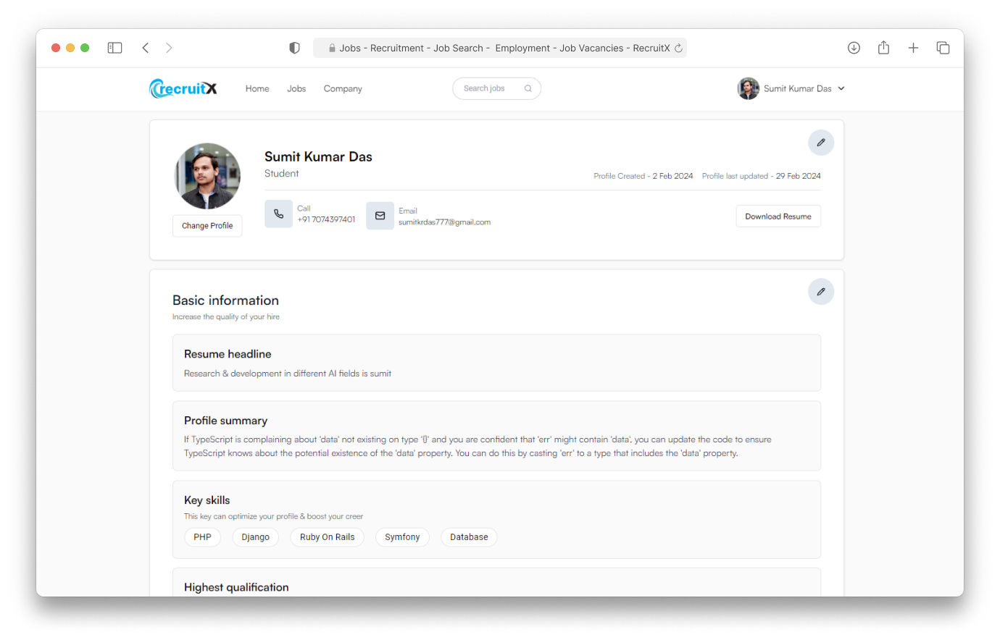
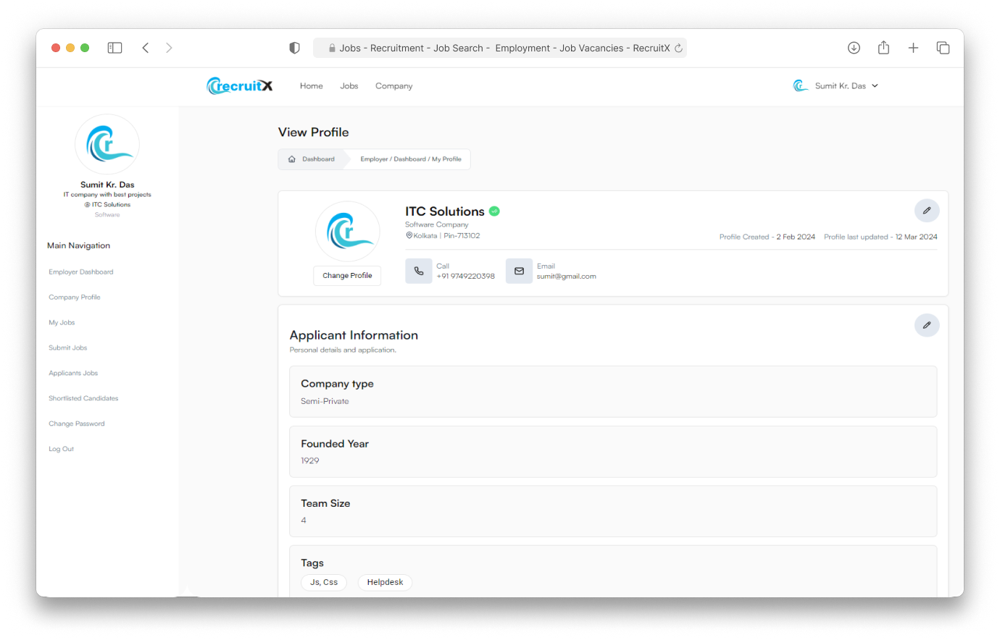

<h1 align="center">RecruitX-Bridging Careers, Connecting Talent</h1>

<h2 align="center">Building a Comprehensive Employment Platform: A MERN-Based Job Portal with Enhanced Functionality</h2>

<br />
<p align="center">
    
    
    
    
    
    
    
    
    
</p>

<h3 align="center"><a href="https://recruitx.vercel.app/"><strong>Want to see live preview »</strong></a></h3>

<p align="center"> 
    <br />&#10023;
    <a href="https://recruitx.vercel.app/">View Demo</a>   &#10023;  
    <a href="https://github.com/sumit-kr-das/recruitx-frontend/issues">Report Bug</a>    &#10023;
    <a href="#Getting-Started">Getting Started</a> &#10023; <a href="#Install">Installing</a> &#10023;    
    <a href="#Contact">Author</a> &#10023;
  </p>

Empower your job search journey with our cutting-edge MERN-based job portal. Seamlessly designed for users, companies, and admins alike, our platform revolutionizes the employment landscape. Users can effortlessly create profiles, explore job opportunities, apply with ease, and receive personalized recommendations tailored to their skills. Meanwhile, companies enjoy streamlined processes for profile creation, job posting, candidate management, and more. Admins wield powerful tools to manage company approvals, user restrictions, and security measures. Experience the future of employment platforms, akin to the renowned functionality of renowned job portals.

Experience Next-Gen Employment Solutions with Our MERN Stack Job Portal!



  <br />

## Screens ( All screens are responsive )

- Home Page
- Job Filter Page
- Job Details & Apply Page
- Search Company Page
- Company Details & Review Company Page
- User Register Page
- User Dashboard Page
- User Profile Page
- User Applied Job Page
- Company Register Page
- Company Dashboard Page
- Post Job Page
- List Job / Update Jobs / Delete Job Page
- View Applied Candidate / Approve Candidate / Reject Page
- List Approved Candidate Page
- Company Change Password Page
- Company Approve / Restrict Page
- User Restrict Page
- OTP Verification Page
- Forgot Password Page
- Login / Logout

<br />

## 🚀 Features

- Login/Signup for User/Company/Admin
- Search Based on Job Title & Job Location
- Debouncing Integration
- Job Sorting Based on Location, Salary, Experience, Job Type, Workplace Type
- Job Pagination (Default 4 Products Per Page)
- Job Add, View, Update, Delete
- Restrict User
- Download CV
- Rich text editor
- Role based routing
- OTP verification
  <br />

## Glimpses of RecruitX portal 🙈 :

 <table>
  <tr>
    <td></td>
    <td></td>
  </tr>
  <tr>
    <td></td>
    <td></td>
  </tr>
  <tr>
    <td></td>
    <td></td>
  </tr>
  <tr>
    <td></td>
    <td></td>
  </tr>
 </table>

<br />

[//]: # "## Demo"
[//]: # "[Check here to see the presentation video of this project](link) "

<br/>

## Getting Started

This project was built using React v 18.2.0, Shadcn, Typescript, Rest API, Node JS, Express and MongoDB. It is a hotel booking web application and for running on your local environment you should follow these guidelines.

### Prerequisites

- NPM
- Node JS
- MongoDB

### Setup

The project repository can be found in [GitHub link](https://github.com/sumit-kr-das/recruitx-frontend) or just clone the project using this command.

```
git clone  https://github.com/sumit-kr-das/recruitx-frontend
```

- Open terminal on your workspace with

```
cd /home/workspace/recruitx-frontend
```

## Install Locally

Install NPM

Check that you have node and npm installed

To check if you have Node.js installed, run this command in your terminal:

```
node -v
```

To confirm that you have npm installed you can run this command in your terminal:

```
npm -v
```

To confirm that you have MongoDB installed you can run this command in your terminal:

```
mongo -v
```

To install all the dependences of the project, run the following command:

```
cd https://github.com/sumit-kr-das/recruitx-frontend
```

```
npm install
```

To run the application got to the client folder and run the following command:

```
npm run dev
```

## Install using Docker

To install all the dependences of the project, run the following command:

```
cd https://github.com/sumit-kr-das/recruitx-frontend
```

Open your docker desktop & run the following command

```
docker build -t recruitx-frontend .
```

```
 docker run --rm --name recruitx -d -p 4173:4173 recruit-frontend
```

### Environment Variables

To run this project, you will need to add the following environment variables to your `.env` file in server folder
`API_BASE_URL`

### Tools used on this project

- Web Storm
- npm create vite template
- MongoDB compass

<br/>

## Contact

If you want to contact with us, you can reach me through below handles.

<h6>Design & Developed by</h6>

[](https://www.linkedin.com/in/sumit-kumar-das-01/)
[](https://twitter.com/Mr_SumitKrDas)
<br />
[](https://www.linkedin.com/in/sk-shoyeb-web-developer/)
[](https://twitter.com/SkShoyebjio)
<br />

<h6>Tested & Content delivered by</h6>

[](https://www.linkedin.com/in/pritam16raha/)
[](https://twitter.com/rahapritam32)

<p>© 2024 Sumit Kumar Das & Sk Shoyeb </p>

## Show your support

Give a ⭐️ if you like this project!
